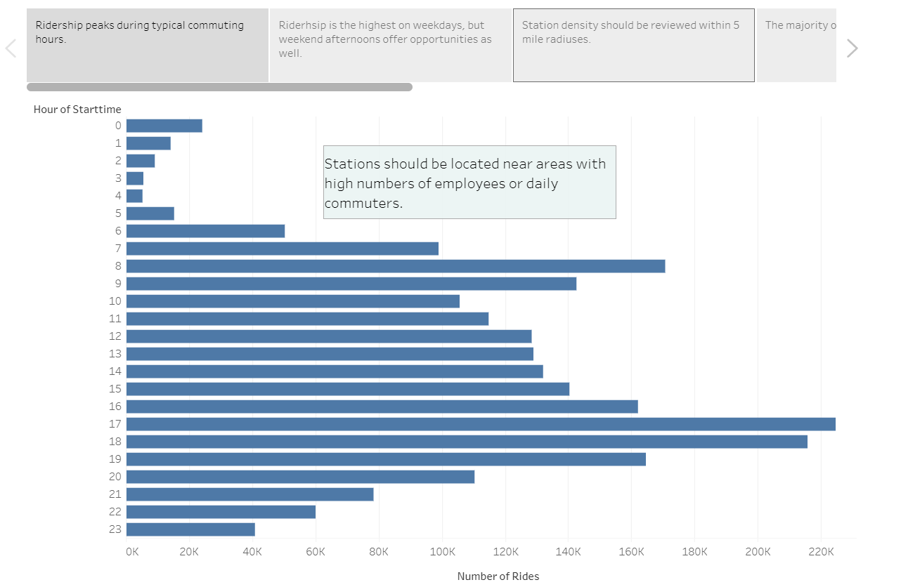
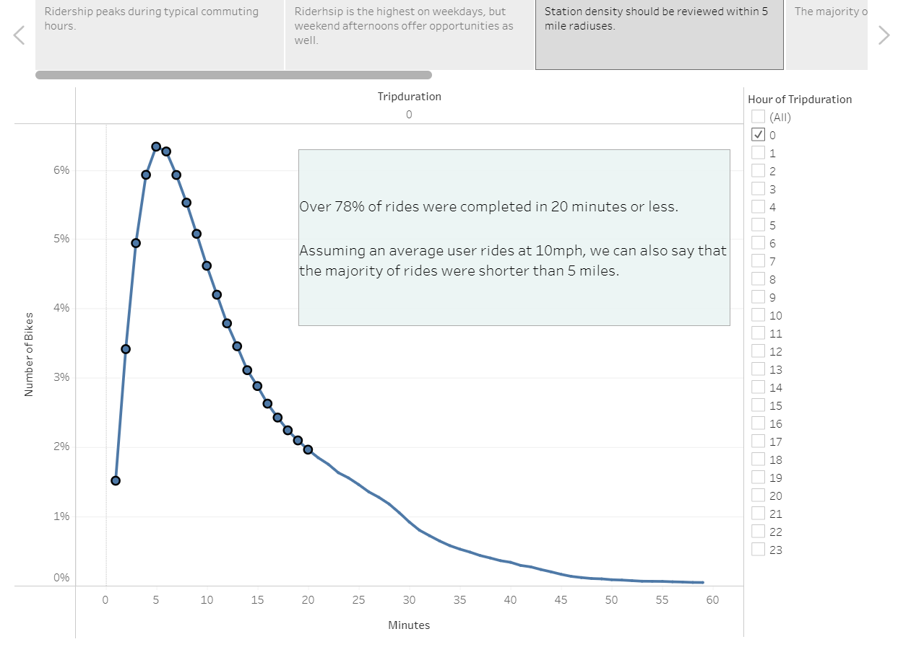
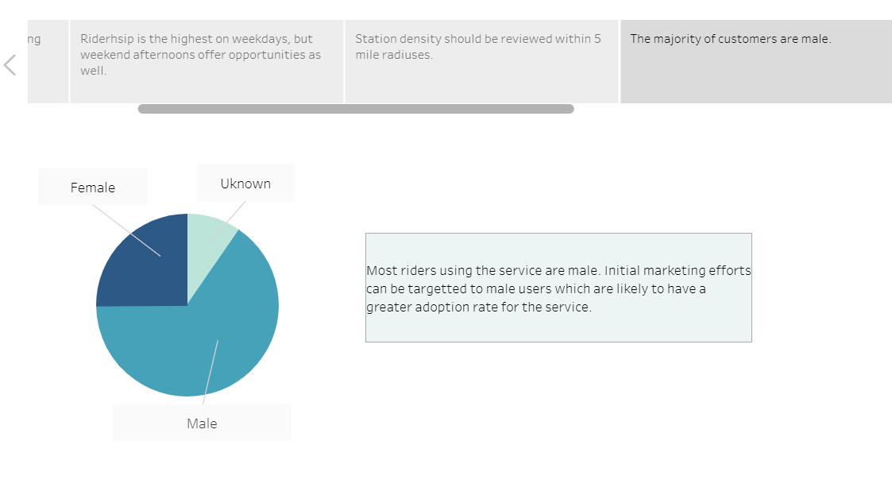
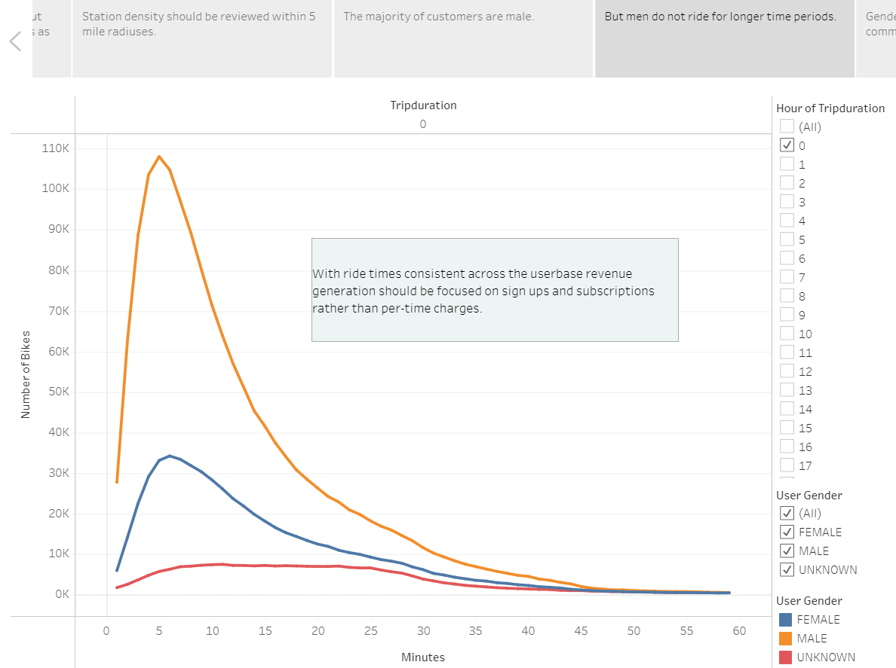
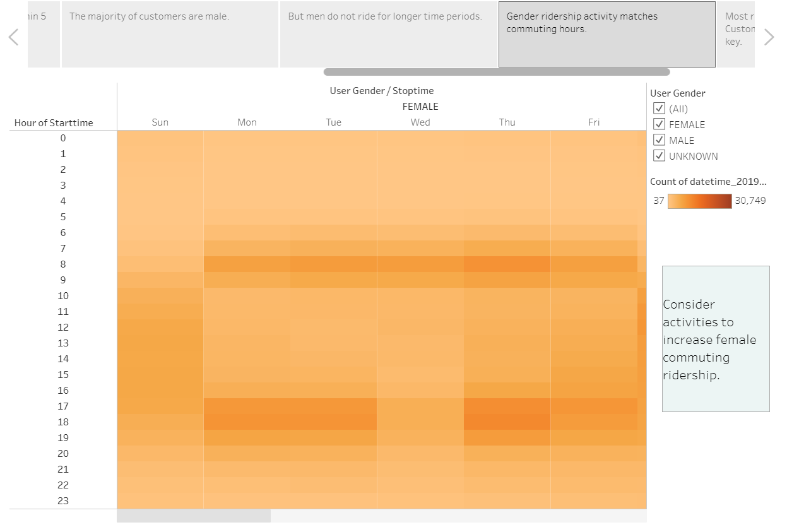
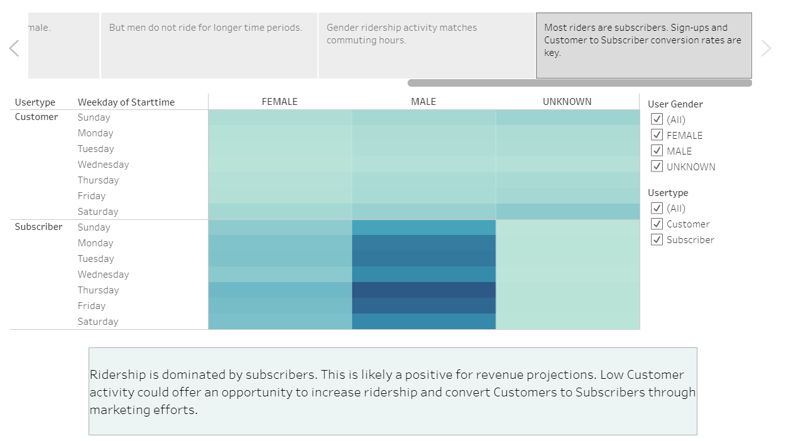

# Bike Sharing Analysis

## Purpose
The purpose of the analysis was to determine the feasibility of operating a bike sharing program in Des Moines, Iowa. Data was collected from the Citi Bike sharing program which operates in New York, New York. Ridership data was analyzed to determine:
* The average length of time bikes are used 
* The number of trips taken in a single month (August 2019)
* How many rides are taken during each hour of each day of the week.
* How subscriber activity differes from single ride customer actity during the week. 

Each datapoint was viewed based on the entire dataset and also presented based on rider gender. [The Tableau Story of the analysis can be found here](https://public.tableau.com/app/profile/trey.graham/viz/CitiBikeRiderAnalysis_16232980489740/BikeUsageAnalysis). 

## Trip and Riderhsip Analysis

### Most Rides Occur During Commuting Hours
The majority of rides occur during typical commuting hours. Bike checkouts peak from 6am to 9am in the morning and peak again between 4pm and 7pm. Afternoon ridership tends to be higher than morning. This could indicate the bike sharing program is seen as a good alternative to other means of transportation in the evenings. It's possible people may be using bikes in the afternoons to travel farther than they would be in the morning, i.e. riding to dinner or to another location other than home after work. 

### Weekdays Have The Most Rider Activity
Overall, ridership is the highest on weekdays. Afternoon ridership also increases later in the week (Thursday and Friday). This could be due to factors such as tourism with customers using the bikes to move around the city when visiting. It could also be a factor of people working shorter hours on Fridays and using the bikes at an earlier time than they would earlier in the week. 

Weekend usage is the highest during the afternoon and early evenings but lags the overall weekday usage. This may provide an opportunity to increase ridership during the earlier weekend hours. The bike sharing program could parter with weekend events which start earlier in the day, for example a farmers' market, to increase weekend trips. 

From an operations perspective, lower ridereship during the workday could provide time for bike maintenance. Depending on how maintenance needs to be performed it may be easier to hire and operate a maintenance crew during typical working hours rather than 12am-5am which is the time period with the lowest amount of activity. 

### Rides Typically Take 20 Minutes or Less
Over 78% of all rides analyzed were completed in 20 mintues or less. If we assume an average user is able to ride at 10mph this would tell us that the majority of rides were less than 5 miles. While the landscape of Des Moines is the same as New York City, knowing how far riders typically go in an urban environment can help guide projections for the number of stations to be built and station density in Des Moines. 

## User Gender Analysis

### Most Riders are Male
The majority of users are male. A small portion of riders did not provide their gender, but even if we assume all "unknown" are female, males riders would still dominate the service. 

Using this information we can reasonably assume that rolling out a bike sharing service in Des Moines would have higher adoption if Men were the initial target audience. Focusing on this market early would likely increase early adoption of the service. 

## Trip Duration is Unaffected by Gender
While men use the service more than women, the typical length of a ride in unaffected by gender. This tells us that when designing a potential station layout stakeholders should focus on overall ridership data rather than making decisions, such as the distance between stations, based on gender metrics. 

## On Most Days Gender Ridership Occurs During the Same Hours
During the week men and women have peak ridership during the same hours. Overall, female ridership still lags male during these peak hours. Stakeholders could focus on marketing strategies to increase female commuting riders to boost usage. 

On the weekends we do see a spread in usage between men and women, with men using the service significantly more than women on Saturdays.

## Most Riders Are Subscribers - Regular Customers Ride More on Weekends
The data shows that the majority of riders are subscribers. Subscriber rides mostly occur during the week, regardless of gender. The high number of subscribers likely indicates more consistent revenue for the bike sharing service which will help with finanial projections for the Des Moines project. 

The data also shows that Customer rides do increase over the weekend. As touched on briefly in prior analysis, this may be a function of tourism or more people visiting areas where the bike stations are located. Using this data we can recommend that marketing strategies related to converting Customers to Subscribers would be best utilized on weekends. 

## Digging Deeper
Further analysis could be performed to better understand rider age demographics. Understanding the number of riders within different age groups could help stakeholders determine whether or not the demographics in Des Moines are similar. For example, if the majority of riders are 18-22 years old but Des Moines does not have a high population of people within that age group ridership numbers will likely be lower. Or, the data may help the Des Moines sharing project design a program that is better suited to local demographics. For example, if the typical age is higher and the typical ride is shorter for older riders then stations may need to be built closer together than they are in New York. 

Additionally, an analysis could be performed on the number of bikes provided at different stations. By looking at the most popular stations and the number of bikes operating at each station it may be determined that the total number of stations could be smaller but the number of bikes provided could be larger. This would also help with cost projections for the Des Moines project because the largest upfront cost of a bike sharing project is likely station construction and bike purchases. Lookig at future costs, less stations could also mean easier maintenance schedules with the more bikes being held at single locations. 

